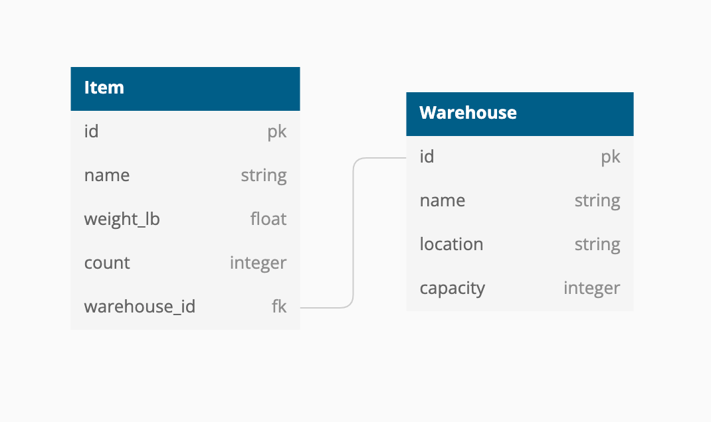

# Inventory Tracker

 
 

# Readme Content
- [Local Setup](#local-setup)
- [Endpoints](#endpoints)
  - [Items](#items)
  - [Warehouses](#warehouses)
- [Database Schema](#database-schema)
- [Test Suite](#test-suite)
- [Contributor](#contributor)

# Local Setup
- Versions
  - Rails 6.0.5
  - Ruby 2.5.1
- Fork and clone the repository
- `cd` in your local repo version and run the following commands
  - To install gems:
    -  `bundle` (if this fails, try to `bundle update` and then retry)
  - To setup database:
    - `rails db:create`
    - `rails db:migrate`
    - `rails db:seed`
- Run your own development server:
  - `rails s`
  - Add URIs to this URL: [http://localhost:3000](http://localhost:3000)

# Endpoints 
## Items
  - `/items`
    - Returns a list of all items
    
  - `/items/new`
    - Create a new item with the specified arguments
    - URI Arguments:  
          `argument :name, String, required: true` 
          `argument :weight_lb, Float, required: true` 
          `argument :count, Integer, required: false, default: 1` 
          `argument :warehouse_id, Integer, required: false` 
           

  - `/items/:id/edit`
    - Edit an item by it's id with the specified arguments
    - URI Arguments:  
          `argument :name, String, required: true` 
          `argument :weight_lb, Float, required: true` 
          `argument :count, Integer, required: false` 
          `argument :warehouse_id, Integer, required: false` 

## Warehouses
  - `/warehouses/new`
    - Create a new warehouse with the specified arguments
    - URI Arguments:  
          `argument :name, String, required: true` 
          `argument :location, String, required: true` 
          `argument :capacity, Integer, required: false` 
           

  - `/warehouses/:id/add_item/:item_id`
    - Add an item to a warehouse based on the warehouse's id and the item's id 

# Database Schema
 

# Test Suite
- Run with `bundle exec rspec`
- All tests should be passing
- 100% test coverage

# Contributor
- Logan Riffell |  [Github](https://github.com/lkriffell)  |  [LinkedIn](https://www.linkedin.com/in/logan-riffell/)